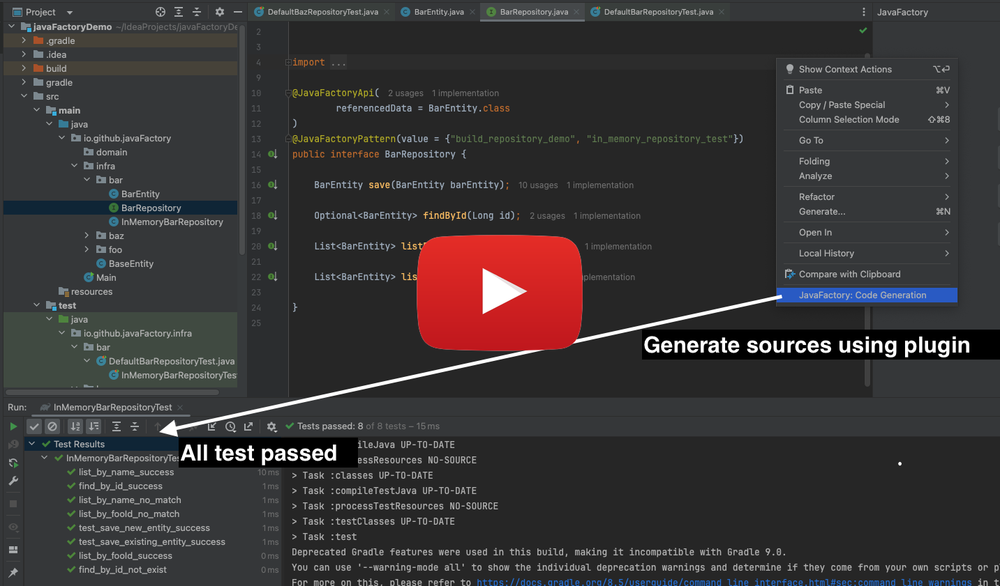

# JavaFactory

**JavaFactory**는 pattern based, annotation 기반의 코드 생성기입니다.
각 작업단위에 대한 규칙, 래퍼런스할 대상을 명확히 정의함으로서, 기존 ai 코드 제너레이터에 비해 더 안정적이고 예측 가능한 결과물을 획득할 수 있습니다.


작업을 명확히 정의해두면,  
**200~300줄의 코드를 30초 만에 생성하고, 30초 만에 검토 후 커밋할 수 있습니다.**  
반복 작업에 시간을 쓰지 않아도 됩니다.


- market place : 
- 설치하기 : `인텔리제이 settings` > `plugin` > `검색: javaFactory`

### 해결하는 문제

- 반복 작업을 LLM 기반 코드 생성으로 대체합니다.
- 작업단위의 규칙(생성, 래퍼런스 규칙)을 통해 AI 코드 생성에서 발생하는 무작위성을 줄입니다.

### 해결 방식

- 반복 작업별로 프롬프트 규칙을 지정합니다.
- 어노테이션을 통해 코드 생성에 필요한 클래스를 명시적으로 지정합니다.


## 데모 영상

[](https://www.youtube.com/watch?v=ReBCXKOpW3M)


## 핵심 기능들


### 1. 패턴을 정의.

[영상]


당신은 당신의 코드 작업에 반복되는 작업을 `패턴`이라는 명칭으로 정의 할 수 있습니다.
패턴에서 당신은 아래 형식에 맞추어 자동화할 작업을 정의할 수 있습니다.

각 작업에 대한 규칙, 래퍼런스할 대상을 명확히 정의함으로서 더 안정적이고 예측 가능한 결과물을 획득할 수 있습니다.


- System prompt
    - Goal : 목적을 정의하세요.
    - Rules: 핵심 규칙들을 정의하세요 .
    - Output: 호출 받을 형식을 정의하세요. 초기값을 바꾸지 않는 것을 추천합니다.
    - Example : 해당 작업 결과물의 보편적 예시를 등록하세요.


- User prompt
    - key - value 형식의 수집 클래스의 내용들.


#### User Prompt


유저 프롬프트 항목에 어떤 소스를 포함시킬지를 선택할 수 있습니다.
아래는 유저 프롬프트의 예시입니다.

> value 값이 어떻게 결정되는지는 `어노테이션 수집 규칙`에서 설명합니다.

[예시이미지] ( ..)


## 2. 어노테이션 수집 규칙


패턴에서 사용할 클래스들은 어노테이션을 통해 명시적으로 범위가 제공됩니다.
각 클래스에 어노테이션으로 역할을 부여하면, 패턴에서 정의한 수집 대상과 일치하는 경우 자동으로 포함됩니다.

어노테이션은 크게 두 가지로 나뉩니다:

- `@JavaFactoryData`
    - `referencedData`에 명시된 클래스들을 **재귀적으로** 수집합니다.
    - 예: 도메인 모델, 엔티티 등 데이터 성격의 클래스

- `@JavaFactoryApi`
    - `referencedApi`와 `referencedData` 항목만 **1단계만** 수집합니다.
    - 해당 api 에 대한 default implementation, test, fixture 클래스를 optional 하게 설정할 수 있습니다.
    - 예: Reader, Writer, Validator 등 API 인터페이스

코드 생성을 위해 어떤 클래스들이 필요하고, 어디까지 포함할지를 명확하게 제어할 수 있습니다.

---


#### 패턴 정의의 예시 .

아래는 제가 domain layer api 의 테스트 코드를 작성할 때 사용하는 실 예시입니다.

#### System prompt

- Goal
```
...
```

- Rules
```
...
```

- output
```
...
```

- example
```

```


### 어노테이션 수집 예시

- 패턴
```java


```


- 데이터1
```java


```

- 데이터2
```java

```

- 하위 api
```
```
